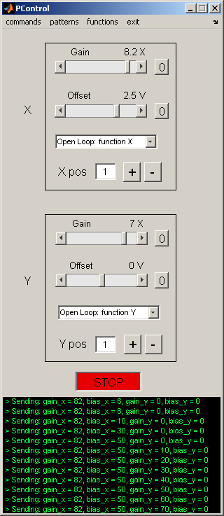

# Theory and Practice of Insect Flight Simulators 

Authors: Mark Frye, Michael Reiser, Michael Dickinson

# History and principles of operation

The devices and techniques described in this document owe much to approaches developed at the Max Planck Institute for Biological Cybernetics in Tübingen, Germany.  This institute grew in the early 1960s around a group of four scientists: Werner Reichardt, Karl Götz, Valentino Braitenberg, and Kuno Kirschfeld, who adopted the visual system of flies as a general model system for neural processing. The term 'Biological Cybernetics' was used to describe to use of information theory, computer science, control theory, etc. to characterize biological systems- the term 'reverse engineering' is often used today to describe similar approaches. This enterprise generated a remarkable body of work, which ranged from detailed anatomical descriptions of visual system circuitry (e.g. discovery of 'neural superposition' in the fly) to sophisticated behavioral and physiological measurements (e.g. characterization of the lobula plate tangential cell system) to development of mathematical model of neural processing (e.g. refinement of the Hassenstein-Reichardt elementary movement detector model).

Perhaps less appreciated, was the work of Karl Götz, who developed an ingenious set of experimental methods for studying the optomotor control of flight in the fruit fly, *Drosophila melanogaster*. The work influenced not only the techniques described here, but also served as the direct foundation for many recent studies of visual spatial memory in *Drosophila*. The focus of his pioneering work was to produce visual stimuli with specific spatial and temporal properties, record the resultant behavioral responses, and then derive the intervening transfer functions. By formalizing the functional relationships between visual input and motor output, he was able to develop and test specific hypotheses about the underlying neural structures. The work was made enormously challenging because there was no “off the shelf” instrumentation at all for such experiments. Götz literally drew the plans for the devices he used throughout his career, often leaving them on the desk of the chief institute machinist before walking home in the early hours of the morning. Götz spent equal time developing ingenious ways of presenting visual stimuli to flies, and clever ways of recording, quantitatively, how the flies responded.  One early device was a complex braid of fiber optic filaments that took the images displayed on an analog oscilloscope and wrapped them into a cylinder surrounding the fly. Another device employed active electromechanical feedback to record the yaw torque generated by a tethered fly. One of his more ingenious experimental techniques was a system that optically tracked the beating wings of a tethered fly, and electronically coupled these signals to rotation of a spinning glass disk, such that light projected through fish eye optics created a pattern of stripes and spots on a circular cylinder surrounding the fly. As the fly (suspended in the middle of a rotating striped drum) tried to turn left, bilateral changes in wing stroke amplitude triggered servomotors to rotate the drum to the right. Under these conditions, the fly has “closed-loop” control over the visual panorama. Using such systems, Götz pioneered studies that linked the responses of the flies visual system to its motor responses in the form of muscle activity, wing motion, and aerodynamic forces. 

Recent technical advances have made flight simulators easier to build and more sophisticated, but the basic architecture remains: present a visual stimulus to the fly, record what it does (in open loop), or provide it with the opportunity of changing what it sees (in closed loop). The new systems are modular and fully programmable for visual images of varying brightness, contrast, and spatial layout. 

# Tethering Flies

The most critical step in collecting high quality data in a flight simulator is tethering the animals. Well-chosen, healthy, properly-tethered (i.e. 'happy') flies will generate hours of data each day. Crappy flies (*sensu* Reiser), poorly tethered are not worth putting in the arena. Here are a few hints regarding the choice and care of flies in preparation for tethering:

- It is quite helpful to use flies reared at low density in bottles, as opposed to high density in vials, as is unfortunately standard in genetics labs. 
- Animals that are 2-3 days old generally provide the best data, but older flies will work if the are healthy. 
- Females fly longer and more readily than males, but this may simply be a scaling effect – female flies are much larger and thus contain greater energy reserves. Large gravid females (with big white abdomens) seem to be the most behaviorally robust. A good, healthy 1.2 mg female will fly for about 1 hour, depending on the experiment. 
- In most experiments, it is convenient to starve flies for 4-8 hours. Starved flies tend to fly more. When starving, provide a damp kimwipe in the vial or bottle so that the flies do not desiccate. 
- Flies are crepuscular animals with activity peaks in the early morning and late afternoon – when it is cool enough to fly and light enough to see. Keep your flies on a strict light:dark cycle and perform your experiments during their crepuscular peaks. The afternoon peak is typically the most convenient. Woe to those that think such details don't matter.
- If necessary for an experiment requiring repeated measures, it is possible to revive a spent fly by feeding it sucrose solution. It is then best to wait at least half an hour to give it chance to process the sucrose into trehalose. Again, your fed, tethered fly may be reluctant to fly again until it is off food for several hours. 
- Temperature is flies' kryptonite. The prefer cool temperature for flight (c. 15-20 degrees C). Unlike moths and bees these animals do NOT need to warm up their flight apparatus and will get quite squirrelly at temperatures over 25 degrees C. This is often a problem because the arena display generates heat. The best setting for experiments is a cool dark room. 

Once you have chosen a healthy batch of flies, the next step is to tether them. In brief, a batch of flies is transferred from a bottle to a small vial that is inserted in a brass block on a cooling stage set at about 4 degrees C. The low temperature anesthetizes the flies within 30 seconds or so. The flies may then be sprinkled on the surface of the cooling stage. Choose a large, healthy-looking fly with wings nicely folded back over its abdomen for transfer to the socket of the 'sarcophagus' using a suction wand. The trickiest part of the process is coaxing a fly into proper position within the sarcophagus using a fine brush. The fly is then held gently in place by suction applied through holes in the bottom of the sarcophagus. The fly is then tethered to a fine tungsten pin using UV-activated glue. Here are some helpful tips on the tethering:

- Avoid damaging the wings with the brush, or the suction sources.
- Use only enough suction in the sarcophagus to stabilize the fly, the suction should not be so strong that the wings are pulled down off the back of the fly.
- Use an etched tungsten probe with a loop at the end to apply a droplet of glue to the tethering pin, then use the 3-D manipulator to transfer the glue from the pin to the fly.
- The most common rookie error is using too much glue. Basically, you should use the bare smallest amount that is required to hold the fly. When you are learning to tether, if you aren't losing an occasional fly because it breaks free of the tether, you are probably using too much glue.
- When gluing the head, make sure that it is oriented straight ahead, and that the head-neck are in a neutral posture, not craned up or down.
- You want the final angle between the tether pin and the long axis of the fly (the pitch angle) to be 90 degrees. This is quite critical. If the pin leans too far back, the wings will hit it when they flap; too far forward and the fly's stroke plane will not be horizontal in the flight arena as required for the optics of the wingbeat analyzer. Improper pitch alignment is the second most common rookie error.
- Make sure that the pin is bilaterally centered on the thorax, any misalignment in body roll makes the prep unusable for focusing the wingbeat analyzer.
- Hit both sides of the glue with a 20 second burst of UV light, get the tip of the gun as close to the fly as possible, but be careful not to bump the prep.
- Don't forget to relieve the sarcophagus suction before removing the tethered fly. This is another common rookie error.
- Watch through the microscope as you withdraw the fly from the sarcophagus – she may stick, and pull free from the tether – if you're watching you can correct by adding a bit more glue. Be familiar with the manipulator so that you pull the tethered fly up, instead of accidentally skewering it on its own tether. 


# Optical Wingbeat Analyzer

The sensor of the wingbeat analyzer (WBA) is composed of two infrared-sensitive silicon wafers (shown below in *red*, one for each wing). An infrared LED suspended above the fly casts a shadow of the beating wings onto the sensor. An optical mask and a high gain amplifier circuit condition the sensor signals such that the final output is a voltage proportional to the position of the shadow cast by each beating wing. Increasing voltage represents increasing forward excursion of the wing, and therefore larger stroke amplitude. 

Viewed from above (fly facing up the page), the shadow cast by the wings (shown in *gray*) must be laterally centered over the cutaway mask (dashed outline), a bit behind the forward edge. The size of the shadow is also important and can be adjusted by (1) moving the fly vertically, (2) moving the IR wand vertically, (3) moving the sensor surface vertically. Once these dimensional adjustments have been optimized, you should maintain them from experiment to experiment by placing the flies in the same position. 


The IR wing sensor provides the analog signal to the wingbeat analyzer, which in turn detects the frequency and amplitude of the downstroke-upstroke reversal, also called the ventral flip. Proper fly alignment over the sensor is crucial – the wingbeat analyzer is a robust instrument and will report spurious values even if the input signal is messy.

If the fly is properly focused over the sensor, then the resultant signal from the wingbeat analyzer should look like this for *each wing stroke*:

---

{: width="30%" .float-right}

- Narrow waveform
- Looks like a little hat == "hütchens"
- quantal cycle-by-cycle amplitude "pops"
- Second peak larger than first

**Good hütchens!**

---
{: .clear}

{: width="30%" .float-right}

- Broad waveform
- No cycle-by-cycle amplitude variation
- Saturated wing signal

**Bad hütchens,** more like a lüdenhut (ask MD) fly is likely too far forward over the mask

---
{: .clear}

{: width="30%" .float-right}

- Narrow waveform
- “Quantal” cycle-by-cycle amplitude variation
- First and second peak equal height, or second is smaller

**Bad hutschienes**, fly is either too far away from the sensor surface, or too far from IR source, or both

---
{: .clear}

The WBA tracks the analog wing sensor signal voltage, and measures a suite of parameters for each wing stroke (defined by the inflections in the hütchens occurring between the user-defined trigger and gate values):

Inputs
- **Source**: left or right wing to set Gate and Trigger
- **Trigger**: voltage threshold to detect peak of downstroke
- **Gate**: time frame to detect peak of downstroke
- **Gain**: amplification of hutschienes – should read 2.5-3.5 Volts for standard DAQ
- **Filter**: low-pass filter analog sensor signals

Outputs
- **Left**: analog signal from IR wing sensor 
- **Right**: analog signal from IR wing sensor
- **Frequency**: stroke frequency in cycles/sec
- **L-R**: left minus right amplitude - proportional to yaw torque
- **L+R**: left plus right amplitude - proportional to thrust
- **Flip**: a brief TTL pulse synchronized with the ventral flip
- **Sync**: a TTL pulse synchronized with each wing beat - used to trigger an oscilloscope sweep

# Panel Controller

{:.float-right}

We tend to refer to the tiled LED array as the “arena”, composed of individual “panels”, the image they display as “patterns”, and the black box that gives it all life the “controller”

## Quick Start

1. switch on the arena
2. insert pre-programmed compact flash card into the controller
3. switch on the controller. Verify that the left-hand green LED is on steady, verify that the two red LEDs to the right of the compact flash card are on steady
4. Start Matlab
5. in the Command Window, type `PControl`
6. Verify the serial connection between the PC and the controller, select: *commands*{:.gui-btn}->*blink LED*{:.gui-btn}, verify the blinking green LED on the controller
7. load a pattern in PControl with the menu *patterns*{:.gui-btn}->*set pattern ID*{:.gui-btn} -> set a *Pattern Index value**{:.gui-txt} (integer value)
8. set Gain to a non-zero value in the appropriate channel (*X*{:.gui-txt} or *Y*{:.gui-txt}), hit *Start*{:.gui-btn}, and *Stop*{:.gui-btn} 

### Open-Loop operation

Once you have loaded a pattern to display in the arena, set the menu options in the X and Y front panel drop down menus to *Open Loop: function X*{:.gui-btn}, and *Open Loop: function Y*{:.gui-btn} (the default modes). Hit *Start*{:.gui-btn}. Play with the Gain and Offset values at will. Can you figure out what X pos and Y pos do? Program a moving pattern by using the *functions*{:.gui-btn} menu to load periodic waveforms. Now manipulate the Gain and Offset controls and hit *Start*{:.gui-btn}.
	
### Open Loop with an external waveform 

From the *patterns*{:.gui-btn} menu, load the checkerboard pattern (hopefully, it is Pattern Index 1). Connect the output of a function generator to ADC1. From the X drop down menu, select *Position: CH5 sets X ind*{:.gui-btn}. Set the X Gain to 2.0 and hit *Start*{:.gui-btn}. Vary the controls on the function generator, and verify that the pattern moves in register with function generator output. Move the checkerboard pattern horizontally by loading an internal function in the Y-channel and selecting the drop-down menu *Open  Loop: function X*{:.gui-btn}.

### Closed-loop operation

The 'closed-loop' mode is similar to running the pattern in Open Loop with an external waveform. The only real difference is that the external function is a time-varying voltage proportional to the fly's wing amplitude (i.e. steering torque). To give the fly control over the X pattern (e.g. load a single stripe pattern, which should occupy the X channel), plug the L and R Amplitude outputs from the Wingbeat Analyzer (not to be confused with L and R Signal Out) ADC1 and ADC2 respectively. Set the X-channel drop-down menu to *Closed Loop: CH1-CH2*{:.gui-btn}. Set the X Gain to 2.0, and hit *Start*{:.gui-btn}. Use the X Offset to balance steering asymmetry. If you wish to run the Y pattern in closed-loop, connect L and R Amplitude to ADC3 and ADC 4 and set the Y-channel drop-down menu to *Closed Loop: CH3-CH4*{:.gui-btn}.

## Operation Details

### LED flight arena

A modular array of 8x8 dot matrix LED panels. Each panel is independently addressable – i.e can show a different visual pattern and can display 8 intensity levels (grayscale). In the current configuration, each LED (pixel) subtends (no more than) ~3.5 degrees at the retina. The arena should always be powered-up when the controller power switch is toggled.

### Arena controller ('black box')

Power cycle: LED arena should be on before toggling the controller power (on or off)\\
ADC1-4: inputs used to control the X and Y pattern position\\
DAC1: voltage proportional to X Position\\
DAC2: voltage proportional to Y Position

The DAC voltages will be values between 0V – 5V. The size of the voltage steps is set by the number of frames in X, Y for the current pattern (e.g. 96 frames in one channel would lead to voltage steps of 5/96 V; frame index 48 would be roughly 2.5 V). These voltage levels are remarkably consistent and can be used to recover the exact frame value for patterns of up to 500 frames (can only be done approximately for larger patterns).

### Control software running in Matlab

`PControl.m` (controller GUI) frequently calls `Panel_com.m`, a case structure of sub-functions used by the GUI. Anything the GUI can do may be executed on the command line (or in a script) with arguments to `Panel_com('argument', [value])`.  You can think of `X` and `Y` as axes of the memory buffer that stores the individual frames to display on the panels. For the arenas we constructed here, each frame of the display will be a 96 x 32 pixel bitmap (corresponding to the number of individual LED's around the azimuth and zenith, resp. of the arena). X and Y correspond to the two dimensions of the array of frames, they do NOT necessarily correspond to the coordinates of the display with respect to the fly. Here's an example: consider a vertical stripe rotating 360 degrees around the fly. This pattern requires 96 individual frames, one for each column of pixels such that if they are displayed sequentially, the pattern looks like a stripe rotating smoothly around the yaw axis. The 96 frames can be stored in `X(1:96), Y(1)`. By contrast, consider a rotating striped drum with each black-white pair composed of 8 pixels. The pattern can be stored in only 8 frames, `X(1:8), Y(1)`, and simply iterated over and over to evoke the perception of pattern moving smoothly around the yaw axis. 
In general, you use PControl and associated functions to design, build, and test the patterns for experiments. Then, you execute individual functions in scripts to conduct a controlled, repeatable experiment. For example,`Panel_com` is a function with a series of different arguments – anything you do with PControl (and some things you cannot) may be programmed by `Panel_com` on the command line. Here are some examples:
 
```matlab
Panel_com('set_pattern_id',4);          % load pattern number 4 from compact flash
Panel_com('set_mode',[1,0]);            % closed-loop mode “Closed Loop: CH1-CH2”
Panel_com('g_level_3');                 % set all panels to grayscale level 3
Panel_com('set_position'[49, 1]);       % set the position to X=49,Y=1
Panel_com('send_gain_bias'[12,0,0,0]);  % send Gain and Bias values
Panel_com('start');                     % begin pattern motion
pause(20);                              % let the pattern run for 20 seconds
Panel_com('stop');                      % stop pattern motion
```

Panel_com commands are detailed in [Technical Appendix 1](#technical-appendix-1).

### Setting the address for a panel, or a column of panels

1. Turn controller off.
2. Unplug the I2C bus from the front of the Controller.
3. Plug a panel (or a column of panels) into the 8-pin header on the front panel of the controller. Use an 8-pin ribbon cable, and make sure to plug the LED panel in as if it were FACE DOWN coming out of the front of the controller panel.
4. Turn on controller.
5. Verify the current panel address.
6. In PControl, select *commands*{:.gui-btn}->*address*{:.gui-btn} and enter two digit values for both selections.
7. Watch the panel address change.
8. Turn off controller and remove panel.

### Building a pattern file

The display of visual patterns requires three separate steps: First, patterns must be created in numeric form most typically using a convenient program such as Matlab, and saved in a suitable format. Second, this file, containing the display information, is burned onto a flash memory card from a computer. Third, the flash memory card is inserted into the Arena Controller, and the contents are downloaded onto the panels using the Controller's software (low-level, nasty C code). 

Although involving many steps, this process is straightforward, especially if using our custom Maltab functions that make this first step easier. The most complicated (for the user) part is constructing the arrays that contain the display information for the panels in the arena. In doing so it is important to keep several concepts in mind. The number of unique panels required for a display may vary. Each 8x8 pixel panel is given an identity, which is set using the procedure described above. When you power up the arena, these IDs are displayed on each panel. The identities may or may not be unique. For example, you may want an arena consisting of 12x4 panels, in which you toggle through a uniform display of grayscales. In this case every panel can have the same ID, because they will each display the identical 8x8 pixel pattern. In contrast, a standard stripe fixation experiment will require 12 unique panel IDs – enough to encode the motion of the stripe around the circle, although each column of 4 panels can have the same ID because they will always display the same pattern. In contrast, an experiment in which you control the azimuthal and elevation angle of a small spot will require that all 48 panels in your 12x4 cylinder have a unique ID. The important thing is to recognize that the way you create a pattern will depend upon the number of unique panels in your arena and their spatial distribution. 

Why would you want non-unique panel IDs? Using unique panel IDs provides the most flexibility, but it does require larger patterns and those patterns will necessarily run slower – the controller must update the complete display. Any display system will have some upper bound on the rate at which it can update the display. This is an issue that should not be ignored, and in the cases where a particular experiment requires a very high frame rate, one option to consider is non-unique IDs. For example, a 12-panel pattern will achieve roughly 4 times the maximum frame rate as a 48-panel pattern.  

Assuming you are making patterns in Matlab using the utility functions written by Michael Reiser, the critical step in creating a display file is using the `make_pattern_vector` command, which operates on a `pattern` structure. The pattern structure has eight critical fields that are required before the structure may be saved in an `*.mat` file and loaded on the compact flash.

`pattern.x_num`  =  the number of frames in the 'x' channel\\
`pattern.y_num`  =  the number of frames in the 'y' channel\\
`pattern.num_panels` = number of unique panel IDs required\\
`pattern.gs_val` = grey scale value; must be either 1, 2, or 3.
	
`1` indicates all pixel values in `pattern.Pats` are binary (0 or 1)
`2` indicates all pixel values in `pattern.Pats` are either 0, 1, 2, or 3. 
`3` indicates all pixel values in `pattern.Pats` are either 0, 1, 2, 3, 4, 5, 6, or 7.

`pattern.Pats` = This field contains the basic data for the displayed images. 

Pats is a matrix of size (L,M,N,O), where:

L is the total number of pixel rows\\
M is the number of pixel columns\\
N is the number of frames in the 'x' direction, same as `pattern.x_num`\\
O is the number of frames in the 'y' direction, same as `pattern.y_num`

Thus, each entry in this LxMxNxO matrix is either one bit (for `pattern.gs_val =1`) or 2 bits (for `pattern.gs_val =2`), or 3 bits (for `pattern.gs_val =3`). Most of the work in generating a display pattern is in creating the Pats matrix. However, if a simple azimuthal shift is required (as in a yaw control experiment), the function `ShiftMatrix.m` can be used to create shifted maps required to depict the moving image.

`Pattern.Panel_map` = this is a vector or matrix that encodes the orientation of the panel IDs.

See notes above for why this is important. A simple example might be:
```matlab
Pattern.Panel_map = [1 2 3 4 5 6 7 8 9 10 11 12];
```

For a case where columns of panels display the same information. A more complicated example might be:

```matlab
A = 1:48;
pattern.Panel_map = flipud(reshape(A, 4, 12));
%  4   8   12   16   20   24   28   32   36   40   44   48
%  3   7   11   15   19   23   27   31   35   39   43   47
%  2   6   10   14   18   22   26   30   34   38   42   46
%  1   5    9   13   17   21   25   29   33   37   41   45
```

where every panel in a 12x4 panel arena needs a unique address. Panels should be addressed starting from 1, and going up to pattern.num_panels.

`pattern.BitMapIndex` = a structure that encodes the spatial panel IDs.

This field can be generated using the function, `process_panel_map.m`, which operates on pattern.Panel_map, e.g. `pattern.BitMapIndex =  process_panel_map(pattern.Panel.Map);`

`pattern.data` = final vector format of the data.

The final vector form of the data that is ready for output can be created using `Pattern.data = make_pattern_vector(pattern);`. The resulting structure is then saved as a `*.mat` file.

Here is an example Matlab script that uses these functions to create a simple panel file for a stripe fixation experiment:

```matlab
pattern.x_num = 96;             % There are 96 pixel around the display (12x8) 
pattern.y_num = 1;              % There is no vertical motion; only one frame is needed
pattern.num_panels = 12;        % This is the number of unique Panel IDs required.
pattern.gs_val = 1;             % This pattern will be binary , so grey scale code is 1;
Pats = zeros(8, 96, ...
    pattern.x_num, ...
    pattern.y_num);             % initializes the array with zeros
stripe_pattern = ...
    [ones(8,88),zeros(8,8)];    % dark pixels for the stripe 
Pats(:, :, 1, 1) = stripe_pattern;

for j = 2:96                    % use ShiftMatrixPats to rotate stripe image
    Pats(:,:,j,1) = ShiftMatrix(Pats(:,:,j-1,1),1,'r','y');
end

pattern.Pats = Pats;            % put data in structure 
pattern.panel_map = 1:1:12;     % define panel structure vector
pattern.BitMapIndex = process_panel_map(pattern);
pattern.data = make_pattern_vector(pattern);
directory_name = 'c:\matlabroot\Patterns';
str = [directory_name '\Pattern_example1']
                                % name must begin with 'Pattern_'
save(str, 'pattern');
```


## Accelerating your patterns

{: width="40%" .float-right}

Let's face it, we all like speed. All the fancy things that one can do with the controller will usually incur a cost—the patterns will probably display slower. By slower, we mean that the controller will spend more time refreshing an individual frame, and thus to keep up with the expected display rate (either set in open-loop by the function generator, or in closed-loop by the fly), the controller will drop frames. Suppose that we want the controller to display a 10 frame pattern at 250 Hz, but the maximum achievable frame rate is 95 Hz. The figure on the right should give a rough idea of the actual sequence of displayed frames as compared to the desired sequence. 
How do you know your maximum achievable rate? Benchmark your pattern. This can be done automatically using the controller—the results are sent out through PC2 serial port. A quick and dirty benchmark can be performed by manually increasing the display rate and observing when the skip-indicating LED (green one, next to the power on LED in the middle of the controller box) starts to blink. 

### How does one get more speed?

1. Simplify the pattern; either by not using grayscale, or by reducing the number of panels used.
2. Use row compression. A large number of patterns we might care to try consist of identical pattern data for all rows of the pattern. When this is the case, a row-compressed pattern will just consist of one row instead of 8. This results in a speedup factor of at least 5. To enable row compression, simply make a pattern with only one row per panel, and include the setting (`pattern.row_compression = 1;`) in the pattern making script. See example below.
3. Use 'identity' compression. The general method outlined for making and sending patterns is simple (elegant, perhaps) but should strike no one as optimal. Many patterns contain large swaths of pixels that are simply on or off. One simple shortcut that has been implemented is to simply send the row-compressed version of the panel data for a panel that corresponds to a pattern piece that is all one value (works for grayscale too!). This feature is not used at pattern making time, but rather while the pattern is running. Identity compression can be enabled by invoking: `Panel_com('ident_compress_on')` from MATLAB. Seems like a brilliant idea, why isn't it just always on? This brings up an important lesson in compression—there are no one-size-fits-all solutions. Sure this methods speeds up the pattern containing a single stripe, but consider a striped drum pattern—all of the extra comparisons needed to determine if a particular panel's piece of the pattern can be sent as a single row, will slow things down considerably and never find a compressible pattern patch.
4. Think outside the box…each pattern can probably be optimized in its own way.

Here is one more example Matlab script that creates a pattern. This one creates a grayscale sine wave grating pattern for a 48-panel display, and uses row compression. This script creates two versions of the patterns with different spatial frequencies, and stores them as Y index 1 and 2.  
 
```matlab
pattern.x_num = 96;         % There are 96 pixel around the display (12x8) 
pattern.y_num = 2;          % two frames of Y, at 2 different spatial frequencies
pattern.num_panels = 48;    % This is the number of unique Panel IDs required.
pattern.gs_val = 3;         % This pattern will use 8 intensity levels
pattern.row_compression = 1;
                            % size of each frame is 4x96, because of row compression. 
Pats = zeros(4, 96, ...     % initializes the array with zeros
    pattern.x_num, pattern.y_num);

% make grating patterns, periods are 120 and 60 degrees, using all 8 gscale values
Pats(:, :, 1, 1) = repmat(round(3.5*(sin((6*pi/96)*[0:95])+1) ), 4, 1);
Pats(:, :, 1, 2) = repmat(round(3.5*(sin((12*pi/96)*[0:95])+1) ), 4, 1);

for j = 2:96                % use ShiftMatrixPats to rotate stripe image
    Pats(:,:,j,1) = ShiftMatrix(Pats(:,:,j-1,1),1,'r','y');
    Pats(:,:,j,2) = ShiftMatrix(Pats(:,:,j-1,2),1,'r','y');
end

pattern.Pats = Pats;        % put data in structure 
A = 1:48;                   % define panel structure vector
pattern.Panel_map = flipud(reshape(A, 4, 12));
pattern.BitMapIndex = process_panel_map(pattern);
pattern.data = make_pattern_vector(pattern);
directory_name = 'c:\matlabroot\Patterns';
str = [directory_name '\Pattern_grating_row_comp']  
                            % name must begin with 'Pattern_'
save(str, 'pattern');
```

Programming the CF (compact flash)

1. Once you have a collection of patterns that you wish to display in the arena, put them all into C:\MatlabRoot\Panels\Patterns\. (you may in fact put them anyplace you wish, but this is the default directory).
2. Plug a Compact Flash reader into any available USB port. Insert a CF card, and verify that it appears as a drive letter. You may be prompted to format the CF, or given some error about the drive being inaccessible – IGNORE THESE.
3.  Insert a CF card into the reader.
4. From PControl, select *patterns*{:.gui-btn}->*load CF*{:.gui-btn}.
5. in the Pattern Selection window, press *Add Folder*{:.gui-btn}, navigate and select the folder storing your pattern files.
6. Hit *OK*{:.gui-btn}.
7. In the Pattern Selection Tool window, verify the patterns you want to store
8. Press *Make Image*{:.gui-btn}.
9. Press *Format & Burn*{:.gui-btn}.
10. Return to the Command Window and hit *Enter*{:.gui-btn}.
11. DO NOT take out the CF card until you see a message confirming that the CF card writing is finished. In the DOS window, you will see something like *128 records in; 128 records out*{:.gui-txt}
12. Make sure the controller is switched off.
13. Pull the CF from the drive, and plug it into the arena controller.
14. Make sure that the arena is powered on, then switch on the controller. 
15. PControl, click *patterns*{:.gui-btn}->*update gui*{:.gui-btn}

Note: to be able to access the patterns on a CF from the PControl GUI, you must be using the CF on the same machine on which it was programmed. If you load patterns onto a CF on machine A, then you may only access them on machine B by using the `Panel_com('set_pattern_id')` command.

# Technical Appendix 1 – User guide to the Panel_com command {#technical-appendix-1}

The `Panel_com` command allows for communication from Matlab to the arena controller. The function takes 2 values – the command and the numerical arguments (when needed).

**Note:** It does not make sense to issue some of these commands while the controller is 'going' – i.e. updating frames. For example, if a 'All off' command is sent while the controller is updating frames – the panels will be off for maybe a few milliseconds – and then the frames will keep updating, so it might not be obvious that this command did anything.

## Useful commands

The following commands are useful for writing scripts to run experiments:

Start – same as pushing the start button on the GUI, controller starts updating frames.\\
Arguments: none\\
Usage: `Panel_com('start');`\\
Special case of this command for camera trigger, usage: `Panel_com('start_w_trig');`

Stop – stops the controller, pattern will freeze on last displayed frame.\\
Arguments: none\\
Usage: `Panel_com('stop');`\\
Special case of this command for camera trigger, usage: `Panel_com('stop_w_trig');`

All off – sets all LEDs to off.\\
Arguments: none\\
Usage: `Panel_com('all_off');`
  
All on – sets all LEDs to on.\\ 
Arguments: none\\
Usage: `Panel_com('all_on');`

Set grey level – sets all LEDs to a greyscale level from 0 to 7:\\
Arguments: none\\
Usage: `Panel_com('g_level_0');   % set all panels to grey level 0;`\\
…\\
`Panel_com( 'g_level_7');    % set all panels to grey level 7;`

Set pattern ID – sets the ID of the pattern\\
Arguments: a single value from corresponding to the pattern number (0 - # pats)\\
Usage: `Panel_com('set_pattern_id', 3);   % set to pattern 3`\\
Note: if ID used is too large – controller will crash - `Panel_com` doesn't check this
  
Set controller mode – sets the mode for the controller's X and Y channels\\
Arguments: 2 values to set the mode for X and Y channels. 0 – open loop, 1 – closed loop, 2 – both, closed loop plus function as bias, 3 – External input sets position, 4 – Internal function generator sets position, 5 – internal function generator debug mode.\\
Usage: `Panel_com('set_mode', [0 1]); % X to open loop, Y to closed loop.`

Set Pattern position – sets the position of the pattern. Controller will send this frame to panels.\\
Arguments: 2 values to set the X and Y positions, must be between 0 and num_x or num_y.\\
Usage: `Panel_com('set_position', [10 1]);`\\
Note, `Panel_com` subtracts 1 from each of these values, because in Matlab, 1 is used as the start index, and the controller uses 0. Also, if the position value is too large – frame will not be correct - `Panel_com` doesn't check this.

Set gain and bias – sets the gain and bias for the X and Y channels on the controller.\\
Arguments: 4 values, 1 each to set gain_x, bias_x, gain_y, bias_y. Values must be signed integers between -127 and +127. Because of this – gain values are multiplied by 10 and bias voltages are multiplied by 20.\\
Usage: `Panel_com('send_gain_bias', [10 -10 0 20]); % sets gain_x = 1X, bias_x = -0.5 V, gain_y = 0, bias_y = 1 V (check PControl to verify this).`

Laser on/off – enables/disables the laser trigger. When this is enables the controller outputs a trigger on DIO 1 and 2 (of opposite activation – one is high, the other is low), when the pattern is in a certain position, that is currently hard-coded in the controller. \\
Usage: `Panel_com('laser_on');` OR `Panel_com('laser_off');`

Identity compression on/off – enables/disables a compression scheme on the controller.\\
Usage: `Panel_com('ident_compress_on');` OR `Panel_com('ident_compress_off');`

Set trigger rate – sets the rate (frequency) of the optional camera trigger.\\
Arguments: 1 value, that must be an integer between 0 and 255.\\
Usage: `Panel_com('set_trigger_rate', [100]); % sets the trigger to 100 fps.`

        
## Commands useful for setup/debugging

Toggle the LED – as a debugging measure, blinks the second green LED on the controller\\
Arguments: none\\
Usage: `Panel_com('led_tog');  % toggles controller LED`

Controller reset – useful for debugging, resets the controller\\
Arguments: none\\
Usage: `Panel_com('ctr_reset') % resets the controller`

Benchmark pattern  - measures the average frame rate for the current pattern, spits results out on second serial ports – use in conjunction with Hyperterminal.\\
Arguments: none\\
Usage: `Panel_com('bench_pattern');`

Reset panel – resets a panel, upon reset, panels show their address\\
Arguments: single value, panel address: 1-127, or 0 for all panels.\\
Usage: `Panel_com('reset', 0); %reset all panels`

Display panel address – has panel display its address\\
Arguments: single value, panel address: 1-127, or 0 for all panels.\\
Usage: `Panel_com('display', 2); %have panel #2 display its address`

ADC test – test the analog inputs to the controller – follow instructions in pop-up window.\\
Arguments – ADC channel to test, a number between 0 and 7\\
Usage: `Panel_com('adc_test', 3); % test ADC channel 3`

DIO test – test the digital I/O lines to the controller – follow instructions in pop-up window.\\
Arguments: ADC channel to measure the DIO lines, a number between 0 and 7\\
Usage: `Panel_com('adc_test', 5); % test DIO using ADC channel 5`

Set panel address – sets the address of an individual panel.\\
Arguments: 2 values, the first for current address, the second for the desired address (must be 0 – 127).\\
Usage: `Panel_com('address', [0 12]); % all panels addressed as 0, go to 12`\\
`Panel_com('address', [11 55]); % all panels addressed as 11, go to 55`\\
Note: 0 is a reserved address – all panels respond to zero.

Send function – send piece of a function to the contoller.\\
Arguments: 52 byte values (integers 0 – 255). Byte 1 is identifier, 1 for X, 2 for Y, 2nd byte is the function segment number (these are 50 byte length segments), starting at zero. then 50 bytes of data. Function buffer is 1000 bytes – so 20 of these calls are needed to fill it.\\
Usage: best done with a for loop – this example is for channel X:
```matlab
for j = 0:19
        start_addr = 1 + j*50;          end_addr = start_addr + 49;
        Panel_com('send_function', [1 j scaled_func(start_addr:end_addr)]);
end
```
Note: functions must be made of signed values, between -127 and + 127, and must be scaled, so that a value of 20 corresponds to 1V [e.g. `scaled_func = round(20.*func);`].


# Technical Appendix 2 – Timing information in each operation mode {#technical-appendix-2}

To control time properly, it is essential to have a clear understanding of the operational scheme:

**Internal function generator** is a vector of 1000 values that plays out over 20 seconds, corresponding to 50 samples/sec. Each value is a single byte, specified as a signed integer, so these can range from -127 to +127 (maybe 128). These values directly corresponds to the frame rate played out, so a 1000 value vector of 5's will produce 5 fps, if the gain is set to 1X. The **gain** is also specified as a single byte, signed integer, so the GUI implements gains from -10 to + 10, by sending out 10 times this value – X gain of 0.5 is sent as gain_x = 5, Y gain of -2.2 is gain_y = -22, etc.

The **bias** is also represented as 1 signed single byte integer. This value implements a virtual voltage, in the GUI, 1V is represented as the number 20 (this is only so we can use the -127 to + 127 range), this is scaled by 2.5 on the controller. 
Note that in the calculations shown below, these are all integer operations implemented in C, the main significance of this is that there is no remainder kept after division (e.g. 10/3 = 3).
Each channel can operate in a few different modes, the timing of pattern display is as follows:

**mode 0, open loop** – in this mode the internal function generator is used to set the display rate. 
So the rate in open loop is calculated as (using X as the example): 

```matlab
X_val = 2*function_X[function_counter];  % take the current function counter value
X_rate = ((X_val*gain_x)/10 + 5*bias_x)/2;
```

The division by 2 is implemented for added precision, but is shown here to explain the exact rate calculation. This value gives the frame rate in fps.

Ex1 – instantaneous function generator value of 10 (the default), gain_x = 1X, bias_x = 0,\\
X_rate = ( (20*10)/10 + 5*0)/2 = 10 fps

Ex2 - instantaneous function generator value of 20, gain_x = -1.5X, bias_x = 0.3 V,\\
X_rate = ( (40*-15)/10 + 5*6)/2 = -15 fps (obviously this is just 15 fps in opposite direction).

**mode 1, closed loop** – in this mode the input voltage difference is used to set the rate, for channel X, this is CH1-CH2, for y, this is CH3-CH4. The a2d conversion digitizes 5 V with a 10 bit resolution, so 5 V maps to 1024, this range is too high, so ultimately we divide this by 4 (divide by 2 twice), so that 1 V maps to about 51 fps.

The rate is calculated as:
```matlab
X_val = (X_ADC1 - X_ADC2 )/2;
X_rate = ((X_val*gain_x)/10 + 5*bias_x)/2;
```

Ex 1 – instant. X_ADC1 = 204 (1 V), X_ADC2  = 307 (1.5V), gain_x = 2X, bias_x = 0.5 V,\\
X_val = (204 – 307)/2 = -51\\
X_rate = ( (-51*20)/10 + 5*10)/2 = -26 fps

Ex 2 - Same as above, but with gain_x = 1X, bias_x = 0.5V\\\
X_rate = ( (-51*10)/10 + 5*10)/2 = 0 fps, note that the bias has exactly cancelled out the 1/2 V input difference.

**mode 2, closed loop with bias** – this mode is basically a combination of modes 1 and 2. 

The rate is calculated as:
```matlab
X_val = (X_ADC1 - X_ADC2 )/2;
X_rate = ((X_val*gain_x)/10 + 2*function_X[function_counter] + 5*bias_x)/2;
```

**mode 3, position control mode** – this mode is completely different from the above modes, the input voltage no longer sets the rate of the display, rather the calculation detailed will set the frame index. This may be confusing, because the notions of gain and bias have been co-opted for this function, and they are not used in exactly the same manner as above. For X, we use ADC5 to set the position, and for Y, we use ADC6. Again the digitizer is a 10 bit digitizer, so 5V maps to 1024, in this mode we do not divide by a fixed value, rather we divide by the gain. For channel x, the calculation of the frame to display is as follows:

```matlab
index_x = X_ADC5/gain_x + bias_x;
if (index_x >= x_num)  {index_x = x_num - 1;} % check if too big, x_num is # frames in x  
if (index_x <= 0)  {index_x = 0;}             % or too small
```

Ex1  – inst. input voltage is 2 V, this will convert to (2/5)*1023 = 409.\\
If gain is 1X, this will divide by 10, so index_x = 409/10 = 40.\\
If the pattern has a 40th frame, that will be displayed, otherwise it will display the last frame.

Ex2 – same 2 V input voltage, gain = 1.5X, bias = -0.5\\
index_x = 409/15 + -10 = 27 – 10 = 17, again, if there is no frame 17 then the last frame will display.

Ex3 – input is 0 V, gain is anything, bias = 1V.\\
index_x = 0/anything + 20 = 20.

**mode 4, function-based position control mode** – this mode uses the function generator to numerically specify the current position. Gain and bias settings are irrelevant. This code shows how the current index for the x channel, index_x, is determined:

```matlab
temp_x_val = (X_pos_index + function_X[function_counter]);
if (temp_x_val >= 0) {index_x = temp_x_val%x_num; }
if (temp_x_val < 0) {index_x = x_num - ((abs(temp_x_val))%x_num); }
```

As you may notice, this implementation uses the function generator as an offset of the value stored in `X_pos_index`, which is set when a new X,Y position is sent to the controller. In this way the same function can be replayed, at different positions (in functions space), without recreating the function.

**mode 5, function generator debug mode** – in this mode, the controller does not update the display, it plays out the function generator through the DAC outputs. The 0-5V DAC output range is used to represent a -5 to + 5 range, so the zero of the function is shifted up to 2.5 V and the range is compressed by a factor of 2 (e.g. -5V is sent out as a zero, 0V as 2.5 V, + 5V as 5V).
