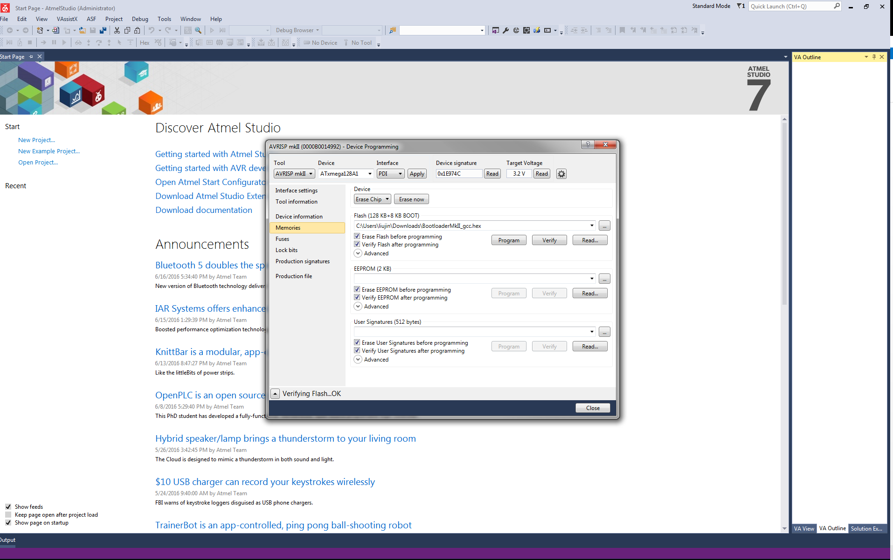
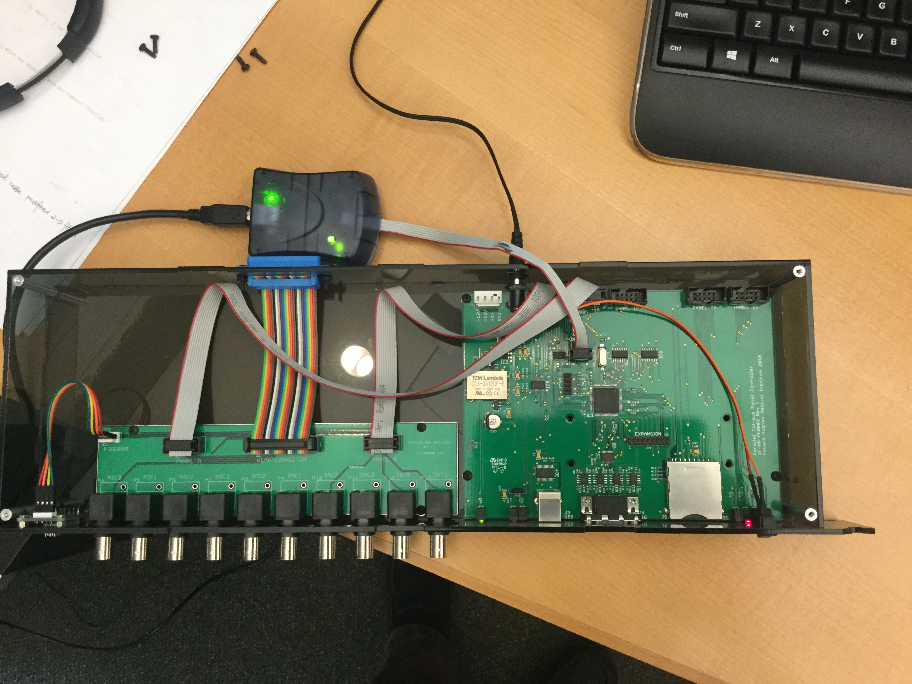

# AVR Studio 4 Directions

{:.ifr .pop}

To get up and running quickly you will need to download the following:

1. download and install [AVR Studio](http://www.atmel.com/dyn/products/tools_card.asp?tool_id=2725&source=redirect) (you need to register before you can download the latest version from Atmel website). You can also download the [AVR studio 4.18](http://www.atmel.com/forms/software_download_splash.asp?family_id=607&referer=http://www.atmel.com/dyn/products/tools_card.asp?tool_id=2725&source=redirect&fn=AvrStudio4Setup%2Eexe) from AVR studio without registration.
1. download [WinAVR](http://sourceforge.net/projects/winavr/files/WinAVR/20100110/) and install it.
1. connect the panel controller box to the pc via USB cable (this will trigger the download of the USB serial driver if not already loaded). If your PC fail to find the driver, use [our copy of the FTDI driver](assets/CDM20808.zip).
1. install bootloader on the controller
    1. download the [bootloader](assets/BootloaderMkII_gcc.hex) for the controller.
    1. connect AVRISP to the controller board
    1. open AVR studio, press the avr button
    1. in the main tab, choose ATXmega128A1
    1. in the fuses tab, choose boot loader reset for the  BOOTRST and press program button
    1. in the program tab, choose the boot loader hex file in the flash frame and then press program button
1. program the controller using AVRDude
    1. check out the panel controller source code from the repository or you can just download the [`panelcontroller.hex`](assets/panelcontroller.hex) and [flash1152.bat](assets/flash1152.bat) and save them in the same folder
    1. flash the hex file to the panel controller
        1. goto the Device Manager on the PC and identify the COM port used by the USB serial driver
        1. edit the `flash1152.bat` file and change the avrdude port argument to the correct port (default is `-P COM5`)
        1. turn on the panel controller hardware, the rightmost LED will turn on. Within 3 seconds double-click the `flash1152.bat` icon, this should open up a command window and the hex file will be downloaded
1. format SD card (supposing the SD disk drive is E) use dos command: `format E: /Q/FS:FAT32/A:32K` or use matlab: `dos('format E: /Q/FS:FAT32/A:32K');`
1. open matlab, setup PControl, run test (blink LED, stream a function, etc).
1. program some panels (including bootloader)
    1. Check out the panel bootloader and application source codes from the repositories. Alternatively you can only download the [boot loader](assets/panel_bl.hex), [`panel.hex`](assets/panel.hex), and [`panel.eep`](assets/panel.eep).
    1. Once the panel is in place, connect the programming device to the 6 pin header, labelled Panel ISP.
    1. Open AVR Studio and start the AVR programming tool STK500/AVRISP from the tools menu.
    1. Test the connection by selecting the Atmega168 device from the drop-down menu, and then try to read signature. If these match, move on, otherwise check the connections, restart, etc.
    1. Press Erase Device to make sure no code in the flash memory
    1. Program the fuses - this is done from the Fuses tab - these options should be set:
        - BOOTSZ choose Boot Flash size = 1024 words start address = $1C00
        - BOOTRST
        - EESAVE[
        - BODLEVEL  choose  Brown-out detection at VCC = 4.3V
        - SUT_CKSEL  Ext. Full-swing Crystal; Start-up time PWRDWN/RESET: 16K CK/14 CK+65MS
    1. Program the bootloader.  Go to the program tab, and choose `panel_bl.hex` for flash. Program it.
    1. Program the panel codes.
        1. make sure uncheck "Erase device before flash programming" because it will erase the bootlader if checked.
        1. select the `panel.hex` as input Hex File  for Flash and program it
        1. select the `panel.eep` as input Hex file for EEPROM  and program it
    1. If this is all done correctly the LED should display 127 and the display should be bright with no flicker. If it appears dull or flickery - the clock was probably not set correctly. It is always a good idea to verify both the program and the fuses to make sure these are set correctly.
    1. Once a panel is programmed it needs to be addressed, this is done using the PControl software.

## AVR Studio 4 Note

1. A combined version, which include both the bootloader and panel code, can be download [here](assets/panel_combined.hex). You can also build the combined hex file with the following steps.
    1. open `panel.hex` with Notepad++ and save it as `panel_combined.hex`
    1. delete the last line: `00000001FF`
    1. open `panel_bl.hex` with Notepad++
    1. select all contents in the `panel_bl.hex` and then copy
    1. paste the binary code to the end of the `panel_combined.hex`
    1. save the file and the `panel_combined.hex` is ready  
1. It is easier to use the auto feature in order to program multiple panels

# AVR Studio 5 Directions

For AVR studio 5, the directions differ slightly. The software is all still free except for matlab, with registration, and can be found on each company's website.

First download and install the following:

- [AVR Studio 5](http://www2.atmel.com/)
- [FTDI Driver](assets/CDM20808.zip) - For USB to Serial COM Port.

1. Make sure the panel controller is recognized as COM3 in Device Manager and PControl (MATLAB). Disconnect the cable between I2C on the the panel controller and the arena.
1. Connect the programming device to the 6 pin header, labelled Panel ISP, in the left corner of the panel controller front panel. Connect a LED panel to the ISP port just below Panel ISP with a ribbon.
1. Open AVR Studio 5 and select *Tools*{:.gui-btn} → *AVR Programming*{:.gui-btn}. In the dialog box, select *Tool*{:.gui-btn} → *AVRRSP mkII*{:.gui-btn} (or other ISP device), *Device*{:.gui-btn} → *ATmega168A*{:.gui-btn} (or ATmega168), *Interface*{:.gui-btn} → *ISP*{:.gui-btn}. Click *Apply*{:.gui-btn}, then *Read*{:.gui-btn}, *Read*{:.gui-btn} for Device ID and Target Voltage. (Target voltage should be 5.0 V)
1. If successfully read, move on, otherwise check the connections, restart, etc.
1. In the Interface settings pane, drag ISP Clock to 250 kHz, click *Set*{:.gui-btn}.
1. In the Memories pane, Click *Erase Device*{:.gui-btn} to make sure there's no code in the flash memory.
1. Program the fuses - this is done from the Fuses pane - these options should be set:
    - BOOTSZ choose 1024W_1C00
    - BOOTRST
    - SPIEN
    - EESAVE
    - BODLEVEL choose 4V3
    - SUT_CKSEL choose EXTFSXTAL_16KCK_14CK 65MS
    - Click *Program*{:.gui-btn}. The info pane should say "Verify fuses...OK".
1. Program the panel codes.
    - Go to the *Memories*{:.gui-btn} pane.
    - make sure to uncheck *Erase device before programming*{:.gui-btn}.
    - select the `panel_combined.hex` as input Hex File for Flash and program it
    - select the `panel.eep` as input Hex file for EEPROM and program it
    - The info pane should say OK.
1. If this is all done correctly the LED panel should display 127 and the display should be bright with no flicker. If it appears dull or flickery - the clock was probably not set correctly. It is always a good idea to verify both the program and the fuses to make sure these are set correctly. Sometimes the Fuses settings change randomly after a panel is programed and need to be re-entered.
1. Once a panel is programmed it needs to be addressed, this is done using PControl in MATLAB. If PControl can't change the panel address, exit PControl, turn the panel controller off and on, then restart PControl.
1. One needs to keep in mind the two different batches of panels from 2007 and 2011 have different maximum brightness and it would be best not to mix them in the same arena.

# Atmel Studio 7 Directions

{:.ifr .pop}

1. install bootloader and firmware on the controller
    1. download the [bootloader](assets/BootloaderMkII_gcc.hex) for the controller.
    1. connect AVRISP to the controller board (see image).
    1. open Atmel studio 7, click Tools → Device programming to open the Device programming window.
    1. Choose AVRISP MKII in Tool, choose ATxmega128A1 in Device. Interface PDI, click Apply button
    1. Click Read button, you can get the Device signature and Target Voltage
    1. In the fuses tab, choose boot loader reset for the BOOTRST and press program button
    1. In the memories tab, choose the boot loader hex file in the flash frame and then press program button, refer to the [image](assets/atmel-studio-7.png).
    1. Choose the [`panelcontroller.hex`](assets/panelcontroller.hex) Rev1.3 in the flash frame and uncheck the erase flash before programming. Press program button.

# Programming New (V3.0) Controllers

1. Download and install avrdude and [WinAVR](http://sourceforge.net/projects/winavr/files/WinAVR/20090313/WinAVR-20090313-install.exe/download)
1. Download  the latest [`panelcontroller.hex`](assets/panelcontroller.hex) and [flash1152.bat](assets/flash1152.bat) to the same directory.
1. Connect the controller to power and its usb to the computer.
1. Using the windows device manager, determine the COM port the controller is listed under. If the controller is not listed under any com ports, right click on the device and point the prompt to the [FTDI Driver](assets/CDM20808.zip).
1. Be sure the COM port listed in the bat file downloaded matches the com port seen in the device manager. If not, change it.
1. Using the command prompt, change directory (cd) to where the hex and bat files were downloaded.
1. In quick succession: turn the controller off, then on, and run the bat file, this should program the controller. If this fails, try changing the time between switching the controller on and running the bat file.

## Atmel Studio 7 Note

a flash card may be needed to program the controller.
