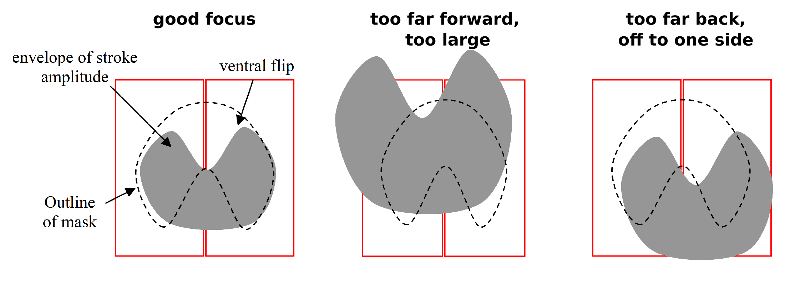
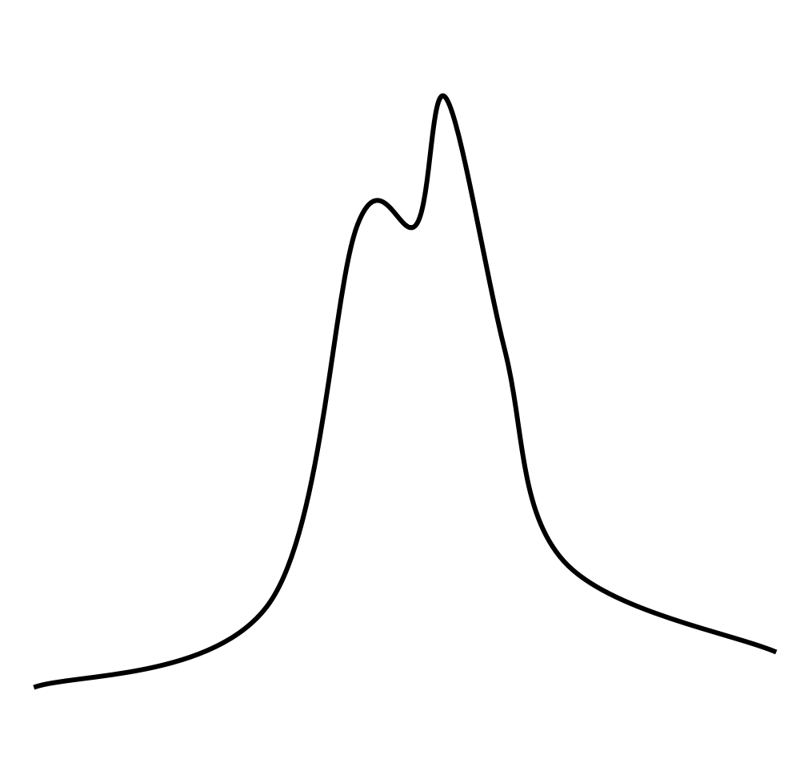
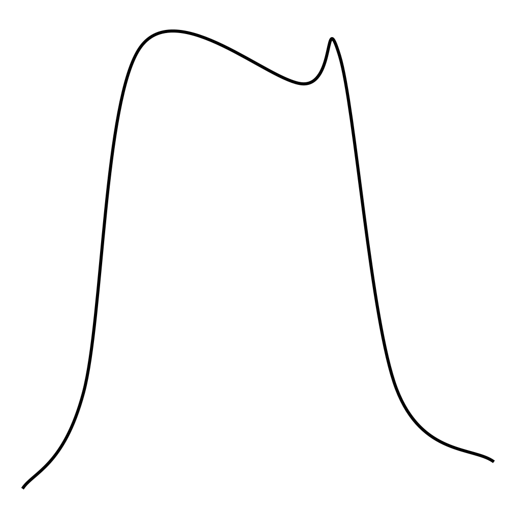
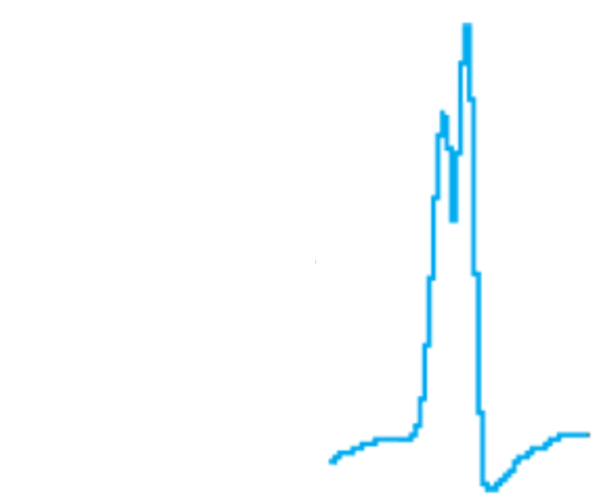
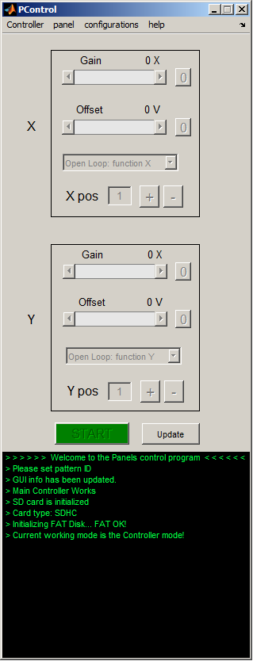
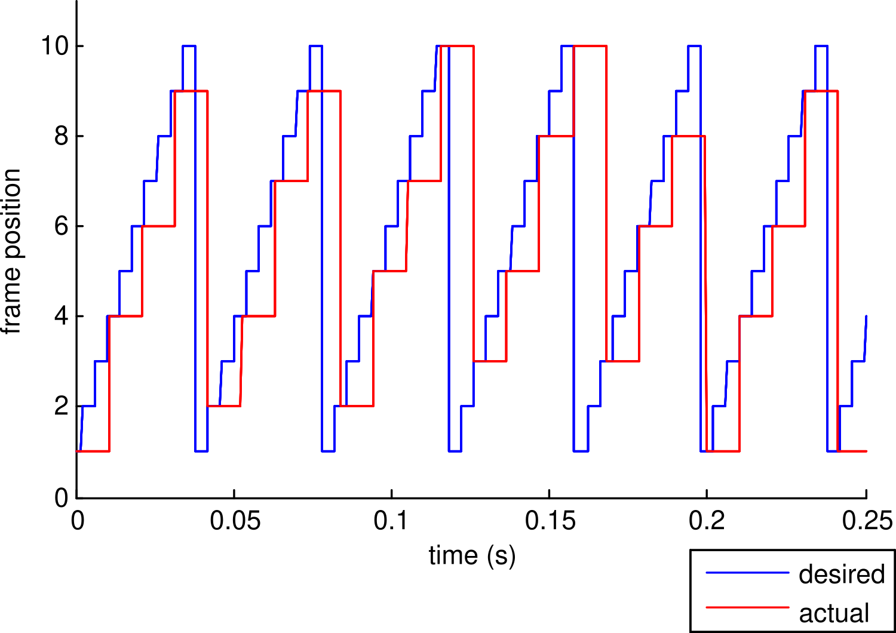

# Panels User Guide

Many people have contributed to this document, including: Mark Frye,
Michael Reiser, Michael Dickinson, Stephen Holtz, Chuntao Dan, Sung Soo
Kim, John Tuthill.

This version of the document, compiled in June, 2022, leverages the [Generation 2 User Guide]({{site.baseurl}}/Generation%202/Arenas/docs/g2_user-guide.html) to the Modular LED Display [Generation 3]({{site.baseurl}}/G3/). It was primarily written as a guide to students in the [Neural System and Behavior Course](http://www.mbl.edu/nsb/).

The technical basis for Modular LED Displays Generation 4 is very different, there is an extensive documentation available as part of this website. If you don't find what you are looking for, please get in [contact]({{site.baseurl}}/Contact).

## Introduction

The flight arena is a powerful tool for addressing questions about
sensory control of behavior, and when paired with genetic techniques,
can be an equally powerful tool for probing neural circuits. This
document offers an introduction to the flight arena and should serve as
a reference when starting to run experiments. It contains a brief
history, an overview of some of the physical components on the arena,
and documentation on arena operation from a computer (see the outline
below). Troubleshooting, assembly and required downloadable content are
all available on the [Modular LED Display Website](https://reiserlab.github.io/Modular-LED-Display/G3/):

Throughout the document we tend to refer to the tiled LED array as the
_arena_, composed of individual _panels_, the image they display as
_patterns_, and the black box that gives it all life as the
_controller_.

## Outline

The rest of the documentation will be divided into the following
sections:

- __[History and Principles of Operation](#history-and-principles-of-operation)__ – Background and principles of arena operation.
- __[Fly Preparation](#fly-preparation)__ – [Fly housing](#housing-flies) and [tethering](#tethering-flies) with some [helpful tips](#effectively-using-flies).
- __[Hardware Overview](#hardware-overview)__ – The common physical components of an arena.
- __[Software Operation](#software-operation)__ – Detailing the components of software for experiments.
- __[Example Experiments](#example-experiments)__ – Using a simple tutorial.
- __[Technical Appendices]({{site.baseurl}}/Generation%203/Software/docs/g3_user-guide_technical-appendix.html) – For more software specific commands and
  operation.

## History and Principles of Operation

The devices and techniques described in this document owe much to
approaches developed at the Max Planck Institute for Biological
Cybernetics in Tübingen, Germany. This institute grew in the early 1960s
around a group of four scientists: Werner Reichardt, Karl Götz,
Valentino Braitenberg, and Kuno Kirschfeld, who adopted the visual
system of flies as a general model system for neural processing. The
term _Biological Cybernetics_ was used to describe the use of
information theory, computer science, control theory, etc. to
characterize biological systems. The term _reverse engineering_ is often
used today to describe similar approaches. This enterprise generated a
remarkable body of work, which ranged from detailed anatomical
descriptions of visual system circuitry (e.g. discovery of _'neural
superposition'_ in the fly) to sophisticated behavioral and physiological
measurements (e.g. characterization of the lobula plate tangential cell
system), to development of mathematical models of neural processing
(e.g. refinement of the Hassenstein-Reichardt elementary movement
detector model).

Perhaps less appreciated, was the work of Karl Götz, who developed an
ingenious set of experimental methods for studying the optomotor control
of flight in the fruit fly, _Drosophila melanogaster_. The work
influenced not only the techniques described here, but also served as
the direct foundation for many recent studies of visual spatial memory
in _Drosophila_. The focus of his pioneering work was to produce visual
stimuli with specific spatial and temporal properties, record the
resultant behavioral responses, and then derive the intervening transfer
functions. By formalizing the functional relationships between visual
input and motor output, he was able to develop and test specific
hypotheses about the underlying neural structures. The work was made
enormously challenging because there was no _off the shelf_
instrumentation for such experiments. Götz literally drew the plans for
the devices he used throughout his career, often leaving them on the
desk of the chief institute machinist before walking home in the early
hours of the morning. Götz spent equal time developing ingenious ways of
presenting visual stimuli to flies, and clever ways of recording,
quantitatively, how the flies responded. One early device was a complex
braid of fiber optic filaments that took the images displayed on an
analog oscilloscope and wrapped them into a cylinder surrounding the
fly. Another device employed active electromechanical feedback to record
the yaw torque generated by a tethered fly. One of his more ingenious
experimental techniques was a system that optically tracked the beating
wings of a tethered fly, and electronically coupled these signals to
rotation of a spinning glass disk, such that light projected through
fish-eye optics created a pattern of stripes and spots on a circular
cylinder surrounding the fly. As the fly (suspended in the middle of a
rotating striped drum) tried to turn left, bilateral changes in wing
stroke amplitude triggered servomotors to rotate the drum to the right.
Under these conditions, the fly has _closed-loop_ control over the
visual panorama. Using such systems, Götz pioneered studies that linked
the responses of the flies visual system to its motor responses in the
form of muscle activity, wing motion, and aerodynamic forces.

Recent technical advances have made flight simulators easier to build
and more sophisticated, but the basic architecture remains: present a
visual stimulus to the fly, record what it does (in open loop), or
provide it with the opportunity of controlling what it sees (in closed
loop). The new systems are modular and fully programmable for visual
images of varying brightness, contrast, and spatial layout.

## Fly Preparation

### Housing Flies

For normal, wild-type experiments, flies are generally stored in
incubators at fixed temperatures on a regular light cycle. For example
flies may be stored at 25° C with lights on from midnight to 4 pm. The
following are some guidelines and tips on storing flies.

- Flies are crepuscular animals with activity peaks in the early morning
  and late afternoon – when it is cool enough to fly and light enough to
  see. One popular approach is to time experiments when flies are most
  active. Flies should be kept on a regular light:dark cycle and perform
  experiments during their crepuscular peaks. The afternoon peak is
  typically the most convenient. This requirement is relaxed at MBL. Our
  flies will still entrain to the daily rhythms of the lab, albeit with
  a peculiar light:dark cycle.
- It is quite helpful to use flies reared at low density. Presorting
  flies a day or two before running the experiment seems to improve
  flight time in some stocks.
- Laboratory stocks which have reproduced for some time in vials can,
  over time, begin to fly less reliably than freshly caught and
  established lines. If possible, crossing two lab stocks can result in
  very high-performance flies.

### Tethering Flies

The most critical step in collecting high quality data in a flight
simulator is tethering the animals. Well-chosen, healthy,
properly-tethered (i.e. _happy_) flies will generate hours of data each
day. Crappy flies (_sensu_ Reiser), poorly tethered are not worth
putting in the arena.

Once you have chosen a healthy batch of flies (see [Housing Flies](#housing-flies)
and [Effectively Using Flies](#effectively-using-flies)), the next step is to tether them. In brief, a
batch of flies is transferred from a bottle to a small vial that is
inserted in a brass block on a cooling stage set at about 4°C. The low
temperature anesthetizes the flies within 30 seconds or so. The flies
may then be sprinkled on the surface of the cooling stage. Choose a
large, healthy-looking fly (usually a female) with wings nicely folded
back over its abdomen for transfer to the socket of the _sarcophagus_
using a suction wand. The trickiest part of the process is coaxing a fly
into proper position within the sarcophagus using a fine brush. Ideally
the fly will remain in place in the bottom of the sarcophagus, but
gentle suction can also be used. The fly is then tethered to a fine
tungsten pin using UV-activated glue. Some helpful tips for tethering:

- [ ] Avoid damaging the wings with the brush, or the suction sources.
- [ ] Avoid getting water on the flies by laying down a Kimwipe on the
  cooling stage and thoroughly wiping the surface of the sarcophagus.
- [ ] Use only enough suction in the sarcophagus to stabilize the fly, the
  suction should not be so strong that the wings are pulled down off the
  back of the fly. The shorter time the fly is under suction, the less
  condensation will accumulate in the sarcophagus.
- [ ] The glue can be dropped onto a glass slide and the very tip of the
  tethering pin may be dipped in. This forms a small droplet at the end
  of the tether.
- [ ] A common _rookie_ error is using too much glue. Basically, you should
  use the smallest amount that is required to hold the fly. When you are
  learning to tether, if you aren’t losing an occasional fly because it
  breaks free of the tether, you are probably using too much glue.
- [ ] When gluing the head, make sure that it is oriented straight ahead,
  and that the head-neck are in a neutral posture, not craned up or
  down.
- [ ] You want the final angle between the tether pin and the long axis of
  the fly (the pitch angle) to be 90 degrees. This is quite critical. If
  the pin leans too far back, the wings will hit it when they flap; too
  far forward and the fly’s stroke plane will not be horizontal in the
  flight arena, as required for proper measurement by the wingbeat
  analyzer. Improper pitch alignment is the second most common rookie
  error.
- [ ] Make sure that the pin is bilaterally centered on the thorax; a
  misalignment in body roll makes for unreliable wingbeat signals.
- [ ]Hit both sides of the glue with a 10 second burst of UV light, get the
  tip of the gun as close to the fly as possible, but be careful not to
  bump the prep.
- [ ] Don’t forget to relieve the sarcophagus suction before removing the
  tethered fly. This is another common rookie error.
- [ ] Watch through the microscope as you withdraw the fly from the
  sarcophagus – she may stick, and pull free from the tether – if you’re
  watching you can correct by adding a bit more glue. Be familiar with
  the manipulator so that you pull the tethered fly up, instead of
  accidentally skewering it on its own tether.

### Effectively Using Flies

Once tethered properly, there are many other tips to get the most out of
your flies during experiments:

- Animals that are 2-3 days old generally provide the best data, but
  older flies will work if they are healthy.
- Females fly longer and more readily than males, but this may simply be
  a scaling effect – female flies are much larger and thus contain
  greater energy reserves. Large gravid females (with big white
  abdomens) seem to be the most behaviorally robust. A good, healthy 1.2
  mg female will fly for about 1 hour, depending on the experiment.
- It may be helpful to starve flies for 4-8 hours prior to experiments.
  Starved flies tend to fly more. When starving, provide a damp Kimwipe
  in the vial or bottle so that the flies do not desiccate.
- If necessary for an experiment requiring repeated measures, it is
  possible to revive a spent fly by feeding it sucrose solution. It is
  then best to wait at least half an hour to give the fly time to
  process the sucrose into trehalose. Again, your fed, tethered fly may
  be reluctant to fly again until it is off food for several hours.
- Temperature is flies’ kryptonite. They prefer cool temperature for
  flight (~20°C). Unlike moths and bees these animals do NOT need
  to warm up their flight apparatus and will get quite squirrelly at
  temperatures over 25°C. This is often a problem because the arena
  display generates heat. The best setting for experiments is a cool
  dark room.
- If possible humidity in the experimental room should be at least 50%
  to prevent fly desiccation and encourage flight.
- To prevent tiring during starvation, or while waiting to use a fly in
  an experiment, a small (size of the fly) piece of paper may be placed
  on the tethered animal (often referred to as a pizza box). This is
  most practically done when the fly is held fixed by its tether in a
  tether holding device.
- A convenient tool for holding flies on tethers while not using them
  can be cut out of plastic, but a weighted Styrofoam block suffices.

## Hardware Overview

The components of a flight arena setup consist of: An [LED arena](#arena), an
[Optical Wingbeat Analyzer](#optical-wingbeat-analyzer), an [arena controller](#controller), a data acquisition board, an [oscilloscope](#oscilloscope) and a computer. In this overview, the optical
wingbeat analyzer, controller, arena, and oscilloscope will be discussed
briefly. The detailed descriptions of the components and instructions
for configuration are available under [Hardware]({{site.baseurl}}/Generation%203/Hardware/docs/).

### Oscilloscope

An oscilloscope is an essential tool in the flight arena for properly
aligning flies. The scale (voltage and timing) of the oscilloscope must
be properly configured so the shape of a few wingstroke cycles can be
visualized.

### Optical Wingbeat Analyzer

The sensor of the wingbeat analyzer (WBA) is composed of two
infrared-sensitive photodiodes (shown below in *red*, one for each
wing). An infrared LED suspended above the fly casts a shadow of the
beating wings onto the sensor. An optical mask and a high gain amplifier
circuit condition the sensor signals such that the final output is a
voltage proportional to the position of the shadow cast by each beating
wing. Increasing voltage represents increasing forward excursion of the
wing, and therefore larger stroke amplitude.

Viewed from above (i.e., with the fly facing up the page), the shadow
cast by the wings (shown in _gray_) must be laterally centered over the
cutaway mask (dashed outline), a bit behind the forward edge. The size
of the shadow is also important and can be adjusted by 

1. moving the fly vertically,
2. moving the IR wand vertically, 
3. moving the sensor surface vertically. 
drop
Once these dimensional adjustments have been
optimized, you should maintain them from experiment to experiment by
placing the flies in the same position. Focusing a camera onto a
well-positioned fly (from behind) will simplify this repeated alignment
between flies.

{:.pop}

The IR wing sensor provides the analog signal to the wingbeat analyzer,
which in turn detects the frequency and amplitude of the
downstroke-upstroke reversal, also called the ventral flip. Proper fly
alignment over the sensor is crucial – the wingbeat analyzer is a robust
instrument and will report spurious values even if the input signal is
messy.

If the fly is properly focused over the sensor, then the resultant
signal from both the left and right outputs of the wingbeat analyzer
should look like this _for each wing stroke_:


> __Good hütchens__
> {: .label .label-green }
>
> {:.ifr .pop}
>
> - Narrow waveform
> - looks like a hat
> - Looks like a little hat == _hütchens_
> - quantal cycle-by-cycle amplitude _pops_
> - Second peak larger than first
{: .clear }

> __Bad Hütchens__
> {: .label .label-red}
> 
> {:.ifr .pop}
>
> - Broad waveform
> - No cycle-by-cycle amplitude variation
> - Saturated wing signal
>
> _It looks more like a lüdenhut (ask MD)_
>
> fly is likely too far forward over the mask
{: .clear}

> __Bad Hütchens__
> {: .label .label-red}
> 
> {:.ifr .pop}
>
> - Narrow waveform
> - Quantal cycle-by-cycle amplitude variation
> - First and second peak equal height, or second is smaller
>
> Fly is either too far away from the sensor surface, or too far from IR source, or both
{: .clear}

> __Good hütchens__
> {: .label .label-green }
>
> {:.ifr .pop}
>
> Another example of good hütchens (screenshot from an oscilloscope)
{: .clear}

Changes to the hütchens that come from moving the fly in the arena are
best learned by experimentation. If possible, align the fly while
presenting a closed loop stimulus (see below) such as a dark stripe for
the fly to fixate on. Some general guidelines for aligning the fly are
as follows:
{: .clear}

- If there is no amplitude variation (the hütchens are not ‘bouncy’) the
  fly is likely too far forward. If the amplitude seems too small,
  increasing the gain, increasing the current from the IR LED, or moving
  the IR LED closer to the fly may help.
- If the left and right hütchens are not identical in shape, double
  check that the fly is glued symmetrically, is facing straight forward,
  and is centered under the LED and above the IR sensor. This can be
  difficult, but well worth the time spent, as it avoids later
  frustrations!
- If the wing hütchens disappear altogether or are saturating the wing
  beat analyzer, the fly is either too close to the IR LED and forward,
  or too far back and away from the IR LED, respectively.
- If fixing a stripe seems to be an issue for a (wild type) fly,
  adjusting left or right slowly and waiting for better fixation is
  probably necessary. By backing the fly up, lowering the gain, or
  reducing the current from the IR LED, you can also reduce the
  difficulty of fixating. To ensure proper alignment, these settings
  should not be different than those used in actual experiments.

The WBA tracks the analog wing sensor signal voltage, and measures a
suite of parameters for each wing stroke (defined by the inflections in
the hütchens occurring between the user-defined trigger and gate
values):

#### Inputs

- __Source__: left or right wing to set Gate and Trigger
- __Trigger__: voltage threshold to detect peak of downstroke
- __Gate__: time frame to detect peak of downstroke
- __Gain__: amplification of hütchens – should read 2.5-3.5 Volts for
  standard DAQ
- __Filter__: low-pass filter analog sensor signals

#### Outputs

- __Left__: analog signal from IR wing sensor
- __Right__: analog signal from IR wing sensor
- __Frequency__: stroke frequency in cycles/sec
- __L-R__: left minus right amplitude - proportional to yaw torque
- __L+R__: left plus right amplitude - proportional to thrust
- __Flip__: a brief TTL pulse synchronized with the ventral flip
- __Sync__: a TTL pulse synchronized with each wing beat - used to
  trigger an oscilloscope sweep

### Arena

LED flight arena: a modular array of 8x8 dot matrix LED panels. Each
panel is independently addressable – i.e. can show a different visual
pattern and can display 16 intensity levels (grayscale). In the typical
12 column circular configuration, each LED (pixel) subtends (no more
than) ~3.5 degrees at the retina. The arena should be powered-up when
the controller power switch is toggled (note that some odd behavior
might occur depending on the order of powering equipment up).

### Controller

The controller is the interface between the PC and the arena. The
following notes document the newer, slimmer version (3.0) of the
controller.

Signals available on the front panel of the arena controller v 3.0 with
the newest controller code (v1.3):

- __ADC0__: analog input in mode 1 and 2 of channel x
  - This input should be in the form of L-R. That is, with a negative
    gain in modes 1 and 2, a negative signal will cause a decrease in
    channel frame and a positive signal will cause an increase in
    channel frame number.
- __ADC1__: analog input in mode 1 and 2 of channel y
  - This works in the same manner as ADC0
- __ADC2__: analog input in mode 3 of channel x
- __ADC3__: analog input in mode 3 of channel y
- __DAC0__: voltage proportional to current frame number (in the unit of
  volt) in mode 1, 2, 3, 4, and PC dumping mode of channel x, update
  analog output in mode 5 (debugging function generator) of channel x;
- __DAC1__: voltage proportional to current frame number (in the unit of
  volt) in mode 1,2,3, 4, and PC dumping mode of channel y , update
  analog output in mode 5 (debugging function generator) of channel y;
- __DAC2__: output from this channel is accessible from MATLAB, see the
  `set_ao` command
- __DAC3__: output from this channel is accessible from MATLAB, see the
  `set_ao` command
- __Int0__: unused;
- __Int1__: timing for fetching and displaying each frame when controller
  works in default mode and PC dumping mode. It is set to high before
  controller fetches a new frame data and reset to low when the
  controller finishes sending the data to the arena.
- __Int2__: laser trigger (see [appendices]({{site.baseurl}}/Generation%203/Software/docs/g3_user-guide_technical-appendix.html) for usage information)
- __Int3__: unused

The DAC0, and DAC1 voltages will be values between 0V…10V. The size of
the voltage steps is set by the number of frames in X, Y for the current
pattern (e.g. 96 frames in one channel would lead to voltage steps of
10/96V; frame index 48 would be roughly 5V). These outputs are
consistent and can be used to recover the exact frame position for
patterns of at least 500 frames (can only be done approximately for
larger patterns). These instantaneous pattern positions are essential
for off-line analysis of closed-loop behaviors, and are useful for
validating open-loop experimental protocols.

## Software Operation

Arena operation requires a MATLAB installation. The specific files
necessary for interfacing with the controller can be downloaded from the
[Software Repository]({{site.baseurl}}/Generation%203/Software/docs/software.html) and added to the MATLAB path. This section contains an overview
of the GUI components and functions, an introduction to software control
of the arena, pattern building commands, pattern acceleration
discussion, and SD flash programming instructions. Many of these
concepts are rehashed in the example experiment section.

### MATLAB GUI Control: PControl

Most of the arena functionality is accessible from the PControl GUI. It
is a good place to start learning the system.

{:.ifr .pop}

#### Quick Start

1. Switch on the arena. Panels will show addresses.
2. Insert pre-programmed SD flash card into the controller.
3. Switch on the controller. Verify that the left-hand green PWR LED is on steady. Arena will go dark.
4. Start MATLAB.
5. In the Command Window, type `PControl`.
6. Verify the serial connection between the PC and the controller, select: _Controller_{:.gui-btn} → _blink LED_{:.gui-btn}, verify the 2nd red LED for “Memory status” blinking on the controller.
7. Load a pattern in PControl with the menu _Configurations_{:.gui-btn} → _set pattern ID_{:.gui-btn} → _Choose a Pattern_{:.gui-btn} from the dropdown menu.
8. First re-zero X and Y Gain and Offset. Set Gain to a non-zero value in the appropriate channel (X or Y), hit _Start_{:.gui-btn}, and _Stop_{:.gui-btn}.

#### Open-Loop operation

Once you have loaded a pattern to display in the arena, set the menu options in the X and Y front panel drop down menus to _Open Loop: function X_{:.gui-txt}, and _Open Loop: function Y_{:.gui-txt} (the default modes). Hit _Start_{:.gui-btn}. Play with the Gain and Offset values at will. Can you figure out what X pos and Y pos do? Program a moving pattern by using the _functions_{:.gui-btn} menu to load periodic waveforms. Now manipulate the Gain and Offset controls and hit _Start_{:.gui-btn}.

#### Open Loop with an external waveform
{:.clear}

From the _patterns_{:.gui-btn} menu, load the checkerboard pattern (hopefully, it
is Pattern Index 1). Connect the output of a function generator to ADC2.
From the X drop down menu, select _Position: ADC2 sets X ind_{:.gui-txt}. Set the X
Gain and hit _Start_{:.gui-btn}. Vary the controls on the function generator, and
verify that the pattern moves in register with function generator
output. Move the checkerboard pattern horizontally by loading an
internal function in the Y-channel and selecting the drop-down menu
_Open Loop: function X_{:.gui-txt}.

#### Closed-loop operation

The _closed-loop_ mode is similar to running the pattern in _Open Loop_
with an external waveform. The only real difference is that the external
function is a time-varying voltage proportional to the fly’s wing
amplitude (i.e. steering torque). To give the fly control over the X
pattern (e.g. load a single stripe pattern, which should occupy the X
channel), plug the L-R Amplitude outputs from the Wingbeat Analyzer to
ADC0. Set the X-channel drop-down menu to _Closed Loop: ADC0 (L-R)_{:.gui-txt}. Set
the X Gain to a negative value, and hit _Start_{:.gui-btn}. Use the X Offset to
balance steering asymmetry. If you wish to run the Y pattern in
closed-loop, connect L-R Amplitude to ADC1 and set the Y-channel
drop-down menu to _Closed Loop: ADC1 (L-R)_{:.gui-txt}.

### Introduction to software control from MATLAB

Events in `PControl.m` (controller GUI) are implemented as calls to
`Panel_com.m`, a case structure of sub-functions used by the GUI. Anything
the GUI can do may be executed on the command line (or in a script) with
arguments to `Panel_com(‘argument’, \[value\])`. You can think of `X` and
`Y` as axes of the memory buffer that stores the individual frames to
display on the panels. For the arenas we constructed here, each frame of
the display will be a 96×32 pixel bitmap (corresponding to the number
of individual LED’s around the azimuth and zenith, resp. of the arena).
`X` and `Y` correspond to the two dimensions of the array of frames, they do
NOT necessarily correspond to the coordinates of the display with
respect to the fly. Here’s an example: consider a vertical stripe
rotating 360 degrees around the fly. This pattern requires 96 individual
frames, one for each column of pixels such that if they are displayed
sequentially, the pattern looks like a stripe rotating smoothly around
the yaw axis. The 96 frames can be stored in `X(1:96)`, `Y(1)`. By contrast,
consider a rotating striped drum with each black-white pair composed of
8 pixels. The pattern can be stored in only 8 frames, `X(1:8)`, `Y(1)`, and
simply iterated to evoke the perception of a pattern moving smoothly
around the yaw axis.

In general, you use __PControl__ and associated functions to design, build,
and test the patterns for experiments. Then, you execute individual
functions in scripts to conduct a controlled, repeatable experiment. For
example, `Panel_com` is a function with a series of different arguments –
anything you do with __PControl__ (and some things you cannot) may be
programmed by `Panel_com` on the command line. Here are some examples:

```matlab
Panel_com('set_pattern_id',4); % load pattern number 4 from SD
Panel_com('set_mode',\[1,0\]); % closed-loop mode "Closed Loop: ADC0 (L-R)"
Panel_com('set_position'\[49, 1\]); % set the position to X=49,Y=1
Panel_com('send_gain_bias'\[12,0,0,0\]); % send Gain and Bias values
Panel_com('start'); % begin pattern motion
pause(20); % let the pattern run for 20 seconds
Panel_com('stop'); % stop pattern motion
```

`Panel_com` commands are detailed in [Technical Appendix 1]({{site.baseurl}}/Generation%203/Software/docs/g3_user-guide_technical-appendix.html).

## Example Experiments

### Building a pattern file

The display of visual patterns requires three separate steps: First,
patterns must be created in numeric form most typically using a
convenient program such as MATLAB, and saved in a suitable format.
Second, this file, containing the display information, is burned onto an
SD (flash memory) card from a computer. Third, the SD card is inserted
into the Arena Controller, and the contents are sent to the panels using
the Controller's software (using low-level, C code, featuring
deterministic timing).

Although involving many steps, this process is straightforward,
especially if using our provided MATLAB functions that make this first
step easier. The most complicated part for the user is constructing the
arrays that contain the display information for the panels in the arena.
In doing so, it is important to keep several concepts in mind. The
number of unique panels required for a display may vary. Each 8x8 pixel
panel is given an identity, which is set using the procedure described
below. When you power up the arena, these IDs are displayed on each
panel. The identities __may__ or __may not__ be unique. The most
flexible experimental setup will require unique panel IDs. It is
important to recognize that the way you create a pattern will depend
upon the number of unique panels in your arena and their spatial
distribution.

The critical step in creating a pattern file in MATLAB is using the
`make_pattern_vector` command, which operates on a `pattern` structure.
The pattern structure has the following critical fields that are
required before the structure may be saved in an `*.mat` file and
loaded on the flash card:

- `pattern.x_num`: the number of frames in the _x channel_
- `pattern.y_num`: the number of frames in the _y channel_
- `pattern.num_panels`: number of unique panel IDs required
- `pattern.gs_val`: grey scale value; must be either `1`, `2`, `3`, or `4`.
    - `1` indicates all pixel values in `pattern.Pats` are binary (`0` or `1`)
    - `2` indicates all pixel values in `pattern.Pats` are either `0`, `1`, `2`, or `3`.
    - `3` indicates all pixel values in `pattern.Pats` fall in the range of `0`…`7`.
    - `4` indicates all pixel values in `pattern.Pats` fall in the range of
`0`…`15`.
- `pattern.row_compression`: `0` or `1`. This sets the simplest available
compression mode. When set to `0`, you produce a pattern as normal, with
8×8 pixels per panel. With row compression enabled (=`1`), the patterns
are 1/8 the size, and are designed as 1×8 pixels per panel. These
patterns are at least 5× faster.
- `pattern.Pats`: This field contains the basic data for the displayed
images.\\
`pattern.Pats` is a matrix of size `(L,M,N,O)`, where:\\
    `L` is the total number of pixel rows\\
    `M` is the number of pixel columns\\
    `N` is the number of frames in the _x direction_, same as
`pattern.x_num`\\
    `O` is the number of frames in the _y direction_, same as
`pattern.y_num`\\
Thus, each entry in this L×M×N×O matrix is either one bit (for
`pattern.gs_val=1`), 2 bits (for `pattern.gs_val=2`), 3 bits (for
`pattern.gs_val=3`), or 4 bits (for `pattern.gs_val=4`). For example, for
`pattern.gs_val=3`, each pixel value can be set as `0`…`7`, where `0` is OFF, `7` is
maximal ON, and the intermediate values linearly scale this intensity.
Most of the work in generating a display pattern is in creating the `pattern.Pats`
matrix. However, if a simple azimuthal shift is required (as in a yaw control experiment), the function `ShiftMatrix.m` can be used to create shifted maps required to depict the moving image.
- `Pattern.Panel_map`: this is a vector or matrix that encodes the orientation of the panel IDs.\\
See notes above for why this is important. A simple example might be:\\
`Pattern.Panel_map = \[1 2 3 4 5 6 7 8 9 10 11 12\];`{:.matlab}\\
For a case where columns of panels display the same information. The
standard `Panel_map` for a 48 panel, 12 column arena is:\\
```matlab
pattern.Panel_map = \[ 12 8 4 11 7 3 10 6 2 9 5 1 ; ...
24 20 16 23 19 15 22 18 14 21 17 13; ...
36 32 28 35 31 27 34 30 26 33 29 25; ...
48 44 40 47 43 39 46 42 38 45 41 37 \];
```
Here every panel in a 12x4 panel arena has a unique address. The Panels
should be addressed starting from 1, and going up to
`pattern.num_panels`. The reason for this peculiar sequence of panels
is that in the v3.0 panel hardware, we use 4 I2C buses, and we want
consecutive panel ID’s to be placed on each of the 4 busses (find the 1,
2, 3, 4, etc. and notice that these are shifted by 3 columns).
- `pattern.BitMapIndex`: a structure that encodes the spatial panel
IDs.\\
This field can be generated using the function, `process_panel_map.m`,
which operates on `pattern.Panel_map`, e.g. `pattern.BitMapIndex = process_panel_map(pattern);`
- `pattern.data`: vector format of the data.\\
The final vector form of the data that is ready for output can be
created using `pattern.data = make_pattern_vector(pattern);` . The resulting structure is then saved as a `*.mat` file.

Here is an example MATLAB script that uses these functions to create a
simple panel file for a stripe fixation experiment:

```matlab
clear all;
pattern.x_num = 96; % 96 frames in X, one per pixel along arena circumference
pattern.y_num = 1; % pattern does not use Y channel
pattern.num_panels = 48; % designed for complete 48 panel arena
pattern.gs_val = 1; % pattern uses 2 intensity levels
pattern.row_compression = 1; % use row compression

% Initial pattern is just one stripe of 8 off pixels
% because we are using row compression the pattern size if just 4 pixels ×
% 96 pixels. We only need to specify one row of pixels per panel
InitPat = ShiftMatrix(\[ones(4,88) zeros(4,8)\], 1, 'r', 'y');

% create Pats as an array sized to hold complete pattern
Pats = zeros(4, 96, pattern.x_num, pattern.y_num);

% frame 1,1 of the Pattern is the Initial Pattern
Pats(:,:,1,1) = InitPat;

% fill in the remaining X positions by shifting each subsequent frame to
% the right by 1 pixel.
for j = 2:96
    Pats(:,:,j,1) = ShiftMatrix(Pats(:,:,j-1,1), 1, 'r', 'y');
end

% map this pattern onto the 48 panel standard arena
pattern.Pats = Pats;
pattern.Panel_map =  [  12  8   4   11  7   3   10  6   2   9   5   1 ; ...
                        24  20  16  23  19  15  22  18  14  21  17  13; ...
                        36  32  28  35  31  27  34  30  26  33  29  25; ...
                        48  44  40  47  43  39  46  42  38  45  41  37];

pattern.BitMapIndex = process_panel_map(pattern);
pattern.data = Make_pattern_vector(pattern);

% store the pattern
directory_name = 'C:\matlabroot\Patterns';
str = [directory_name 'Pattern_2_stripe_48P_RC']
save(str, 'pattern');
```

### Accelerating your patterns

{:.ifr .pop}

Let’s face it, we all like speed. All the fancy things that one can do with
the controller will usually incur a cost—the patterns will probably
display slower. By slower, we mean that the controller will spend more
time refreshing an individual frame, and thus to keep up with the
expected display rate (either set in open-loop by the function
generator, or in closed-loop by the fly), the controller will drop
frames. Suppose that we want the controller to display a 10 frame
pattern at 250Hz, but the maximum achievable frame rate is 95Hz. The
figure on the right should give a rough idea of the actual sequence of
displayed frames as compared to the desired sequence.

How do you know your maximum achievable rate? Benchmark your pattern.
This can be done automatically using the controller and the results are
visible in __PControl__. A quick and rough benchmark can be performed by
manually increasing the display rate and observing when the
skip-indicating LED (green one, next to the power on LED in the middle
of the controller box) starts to blink.

#### How does one get more speed?

1. Simplify the pattern. Either don’t use grayscale, reduce the number
    of panels used, or update the arena configuration to disable a
    subset of the panels in your arena (e.g. you can mask out the top
    and bottom row and just drive your pattern in the central 2 rows
    along the equator of the flies’ eye).
2. Use row compression. A large number of patterns we might care to try
    consist of identical pattern data for all rows of the pattern. When
    this is the case, a row-compressed pattern will just consist of one
    row instead of 8. This results in a speedup factor of at least 5. To
    enable row compression, simply make a pattern with only one row per
    panel, and include the setting (`pattern.row_compression = 1;`) in the
    pattern making script. See example above.
3. Use ‘identity’ compression. The general method outlined for making
    and sending patterns is simple (elegant, perhaps) but should strike
    no one as _optimal_. Many patterns contain large swaths of pixels
    that are simply on or off. One simple shortcut that has been
    implemented is to simply send the row-compressed version of the
    panel data for a panel that corresponds to a pattern piece that is
    all one value (works for grayscale too!). This feature is not used
    at pattern making time, but rather while the pattern is running.
    Identity compression can be enabled by invoking:
    `Panel_com('ident_compress_on')` from MATLAB. Seems like a brilliant
    idea, why isn’t it just always on? This brings up an important
    lesson in compression—there are no one-size-fits-all solutions. Sure
    this methods speeds up the pattern containing a single stripe, but
    consider a striped drum pattern—all of the extra comparisons needed
    to determine if a particular panel’s piece of the pattern can be
    sent as a single row, will slow things down considerably and never
    find a compressible pattern patch.
4. Use _super-speed mode_ where for small patterns with few frames, the
    data can be stored locally on the panels.
5. Think outside the box… Each pattern can probably be optimized in its
    own way.

### Programming the SD Flash Card

The SD card is where you store patterns and functions for running the
arena. These are programmed onto the SD card using __PControl__ and then
moved to the Controller.

1. Once you have a collection of patterns that you wish to display in
    the arena, put them all into `C:\matlabroot\patterns\`. You may in
    fact put them any place you wish, but this is the default directory.
2. Plug a SD Flash card into a port, using a USB card reader. Verify
    that it appears as a drive letter (usually E).
3. In MATLAB, run `PControl`, and select _configurations_{:.gui-btn} → _load pattern
    to SD_{:.gui-btn}.
4. In the _Pattern Selection_{:.gui-txt} window, press _Add Folder_{:.gui-btn}, navigate and
    select the folder storing your pattern files. You may also
    individually add the patterns, if this becomes time consuming to
    achieve the correct order of patterns, consider naming each pattern
    as `Pattern_##_id` where `##` is the number you wish the pattern to
    be and id is an identifying name. This will ensure the patterns in
    the folder selected are added in the correct order
5. Hit _OK_{:.gui-btn}.
6. In the _Pattern Selection Tool_{:.gui-txt} window, verify the patterns you want
    to store.
7. Press _Make Image_{:.gui-btn}, then _Burn_{:.gui-btn}. If you are prompted for the drive
    letter at any time, type it into the prompt and press OK.
8. DO NOT take out the SD card until you see a message confirming that
    the SD card writing is finished.
9. Plug the SD card into the arena controller. You may need to turn the
    controller off and on for it to recognize the card correctly.
10. To test the pattern, open up `PControl` and select _configurations_{:.gui-btn} →
    _set pattern ID_{:.gui-btn} → _your pattern_{:.gui-btn} (from the dropdown menu). Now you can
    use the PControl GUI to run your pattern by selecting values and
    pressing the _start_{:.gui-btn} button.

To be able to _automatically_ access the patterns on an SD
card from the PControl GUI, you must be using the SD on the same machine
on which it was programmed. If you need to load patterns from an SD card
programmed onto another machine (or if you see that patterns and/or
functions copied onto the card behave strangely, you should synchronize
the SD information from the card to your PC by clicking on the
_controller_{:.gui-btn} → _sync SD info_{:.gui-btn} menu items in the PControl GUI.
{: .warning}

### Loading Functions to SD card

The process for storing functions onto the SD card is similar, except
you use _configurations_{:.gui-btn} → _load functions to SD_{:.gui-btn}. It is best to program
all patterns and functions you will need for your experiments onto the
SD card and then move it over to the controller.

### Loading Arena Configurations to SD card

The process for storing arena configurations onto the SD card is
similar, except you use _configurations_{:.gui-btn} → _load config to SD_{:.gui-btn}. This
document currently does not explain arena configurations, but these are
a critical aspect of running the v3.0 arena. For these exercises, use
the default configurations provided for you.

## Original file

This user guide is an online version of the original flight simulator user guide (available for [download in the original file format](assets/Flight%20Arena%20User%20Guide%202022.docx)).